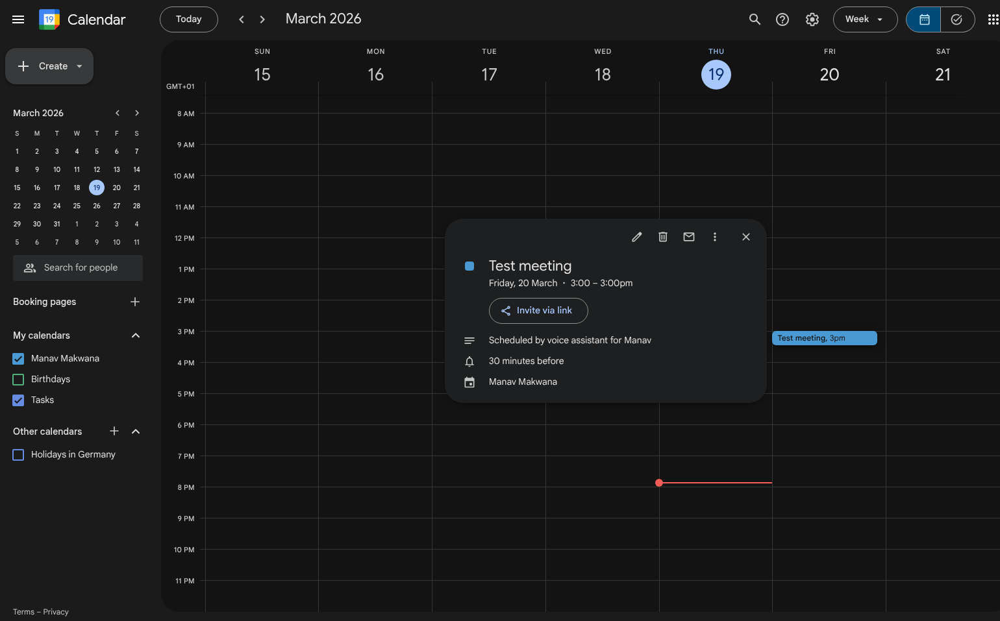

# Voice Agent Ryan (FastAPI + VAPI + Google Calendar)

This project is a real-time voice-based scheduling agent that collects user info, confirms details, and creates a calendar event.

## Live deployment
- Demo URL: https://vapi.ai/?demo=true&shareKey=0b7b5d62-d2f9-4cb3-bfd1-9a063e93378b&assistantId=310bcb8b-08c6-4c4a-afe5-453ccf6895e6
- Deployed URL: https://voice-agent-backend-uewn.onrender.com/

## Assets (interactive media)

### 1) Audio log 


### 2) Calendar screenshot



## Assignment overview

The app:
- initiates a conversation with the user
- gathers name, preferred date and time, and optional meeting title
- confirms the final details
- creates a real calendar event via Google Calendar
- is available through a hosted endpoint (via Render/ngrok)

## Features

- FastAPI endpoint: `POST /create-event`
- Basic `GET /create-event` health and webhook validation
- Pydantic request model for payload validation
- Optional Google Calendar integration via service account
- Local and deployed mode supported

## How to test (deployed)

1. Open the Demo URL.
2. Follow voice prompts / webhook flow to submit a scheduling request.
3. Verify event creation in Google Calendar.

## How to run locally (optional)

1. Clone:

```bash
git clone <https://github.com/RustedSwords/voice-agent-Ryan>
cd Voice-agent-Ryan
```

2. Install dependencies:

```bash
pip install -r requirements.txt
```

3. Google credentials:

```bash
export GOOGLE_APPLICATION_CREDENTIALS="/path/to/service-account.json"
```

4. Run:

```bash
uvicorn main:app --reload --host 0.0.0.0 --port 8000
```

5. Use ngrok for webhook callbacks:

```bash
ngrok http 8000
```

6. Send a test request:

```bash
curl -X POST "https://<ngrok-id>.ngrok.io/create-event" \
  -H "Content-Type: application/json" \
  -d '{"name":"Ryan","date":"2026-03-20","time":"15:00","title":"Test meeting"}'
```

## Calendar integration

- Uses `create_google_event` in `main.py`.
- Requires `GOOGLE_APPLICATION_CREDENTIALS` with Calendar API access.
- Creates a 1-hour event from the provided date and time.

## Assets provided

- Audio log in `src/` (initial voice prompt flow)
- Calendar screenshot in `Calendar_ss` (event created confirmation)

## Troubleshooting

- `405 Method Not Allowed`: wrong method (use POST for event creation)
- `422 Unprocessable Entity`: invalid JSON schema
- ngrok inspector: `http://127.0.0.1:4040`

## License

MIT
